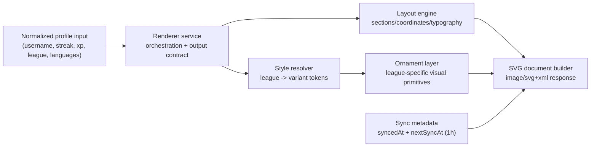
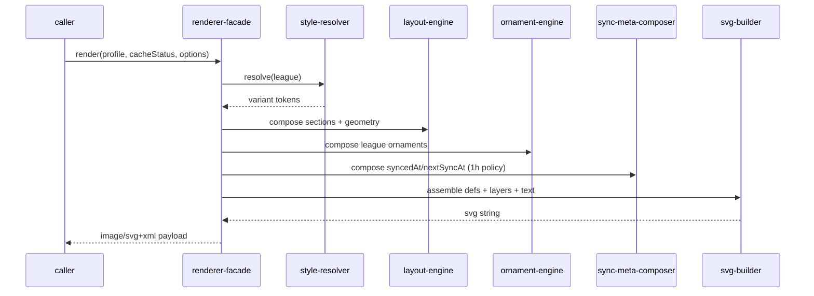

# Architecture

`duolingo-readme-stats` is a renderer-first project architecture for generating
README-ready Duolingo SVG cards. The design centers on two hard requirements:
**(1)** provide SVG image output, and **(2)** provide different SVG visuals by
Duolingo league, while keeping a **1-hour synchronization cadence** in metadata.

## Visual overview

## Module map

| Module               | Responsibility                                                                             | Main collaborators                               |
| -------------------- | ------------------------------------------------------------------------------------------ | ------------------------------------------------ |
| `renderer-facade`    | Entry point that accepts normalized data and returns one SVG document                      | `style-resolver`, `layout-engine`, `svg-builder` |
| `style-resolver`     | Selects league variant tokens (gradient, chip/divider styles, ornaments, motion intensity) | `league-style-map`, `renderer-facade`            |
| `league-style-map`   | Authoritative mapping for the 10 Duolingo leagues and fallback style                       | `style-resolver`                                 |
| `layout-engine`      | Deterministic geometry and section composition (header, stats, language chips, footer)     | `renderer-facade`, `svg-builder`                 |
| `ornament-engine`    | League-specific decorative primitives (`shards`, `orbs`, `rings`, `stripes`, `mesh`)       | `style-resolver`, `svg-builder`                  |
| `sync-meta-composer` | Computes and formats sync metadata (`nextSyncAt = syncedAt + 1 hour`)                      | `renderer-facade`, `svg-builder`                 |
| `svg-builder`        | Emits final XML/SVG with defs, style blocks, and content layers                            | all rendering modules                            |
| `error-renderer`     | Produces fallback error SVG for invalid or unavailable data                                | `renderer-facade`                                |

## Reference-informed design choices

This architecture is intentionally informed by:

1. `anuraghazra/github-readme-stats`
2. `centrumek/duolingo-readme-stats`

### Adopted patterns from `github-readme-stats`

- **Renderer endpoint contract**: request-in, SVG-out architecture.
- **Theme/token strategy**: use style tokens and variants rather than one
  monolithic hardcoded SVG template.
- **Composable card sections**: consistent section composition for header,
  metrics, and supporting detail layers.
- **Error SVG fallback**: keep output format stable by returning SVG even on
  error paths.

### Adopted patterns from `duolingo-readme-stats`

- **Duolingo-specific metric focus**: streak, total XP, weekly XP, league, and
  language XP distribution.
- **League progression ordering**: Bronze -> Silver -> Gold -> Sapphire -> Ruby
  -> Emerald -> Amethyst -> Pearl -> Obsidian -> Diamond.
- **Weekly XP semantics**: treat weekly XP as a time-windowed metric.
- **Language list presentation**: sort language entries by XP contribution for
  renderer readability.

## Runtime flow (renderer mode)

1. Caller provides normalized profile input (including league and languages).
2. Renderer resolves league variant style from the authoritative league map.
3. Layout and ornament layers are built using deterministic geometry.
4. Sync metadata is applied with a fixed 1-hour cadence contract.
5. Final SVG is emitted as a single standalone XML document.

## League taxonomy

Renderer style mapping must support exactly these leagues:

1. Bronze
2. Silver
3. Gold
4. Sapphire
5. Ruby
6. Emerald
7. Amethyst
8. Pearl
9. Obsidian
10. Diamond

## Duolingo domain reference (Wiki-based)

Based on Duolingo Wiki content (`League`, `Leaderboard`, `XP`), the renderer
domain assumptions are:

- Leagues are part of weekly leaderboard competition mechanics.
- The wiki describes league competition refresh as weekly (Monday, 4:00 AM GMT).
- League groups are described as leaderboard cohorts with XP-based ranking.
- XP is the underlying scoring unit for progression and leaderboard ordering.

Because the wiki itself can change over time, renderer logic should treat these
as **reference assumptions** and keep league mapping configurable.

## Renderer implications from Duolingo mechanics

- Since ranking is XP-centric, card emphasis should prioritize total XP and
  weekly XP visibility.
- Since league identity is a visible progression signal, style variation by
  league must be visually obvious even before reading text.
- Since leaderboard timing is periodic, freshness metadata (`syncedAt`,
  `nextSyncAt`) must remain explicit in the card.

## Visibility rules

- Keep renderer entry contract stable: one normalized input model in, one SVG
  document out.
- Keep business metrics and visual tokens separated:
  - metrics (`streak`, `xp`, etc.) do not decide geometry
  - league style tokens decide presentation only
- Expose only a minimal public renderer facade; keep variant/geometry internals
  private to avoid style drift.
- Always keep a fallback style path for null/unknown league values.

## File conventions

- Use a **facade + focused submodules** pattern:
  - `renderer-facade`
  - `style-resolver` + `league-style-map`
  - `layout-engine`
  - `ornament-engine`
  - `sync-meta-composer`
  - `svg-builder` + `error-renderer`
- Keep all league token definitions centralized in one place.
- Keep style tokens declarative (data objects), not scattered conditional logic.
- Keep sync cadence rules (`1 hour`) in one dedicated metadata policy layer.

## References

- https://duolingo.fandom.com/wiki/Duolingo_Wiki
- https://duolingo.fandom.com/wiki/League
- https://duolingo.fandom.com/wiki/Leaderboard
- https://duolingo.fandom.com/wiki/XP
